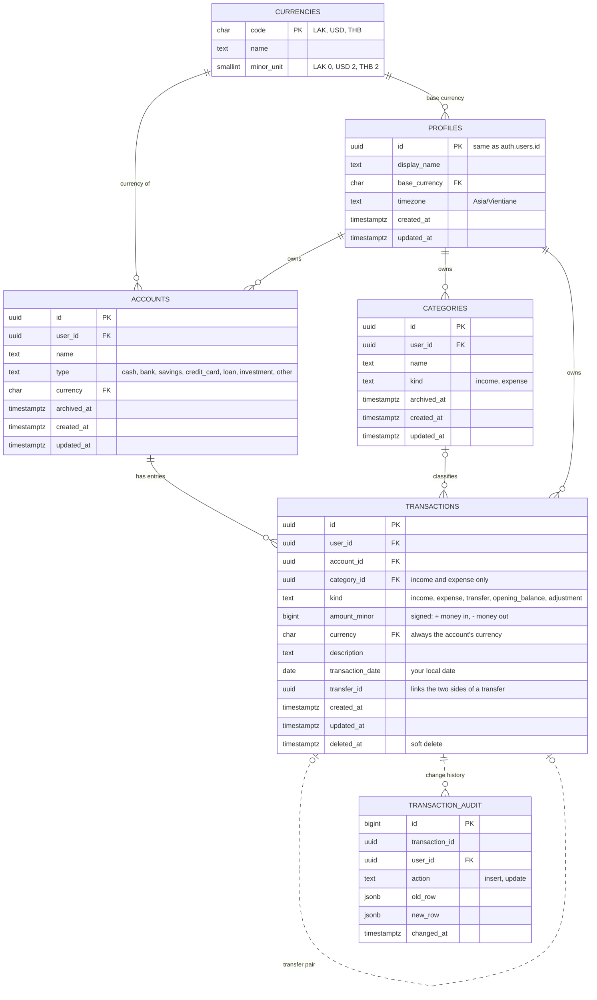

# Database

Phase 0 · 2026-10-09 · PostgreSQL on Supabase · Decisions: [ADR-001](adr/001-postgresql.md), [ADR-003](adr/003-money-integer-minor-units.md), [ADR-005](adr/005-derived-balances.md), [ADR-006](adr/006-transactions-as-legs.md), [ADR-007](adr/007-soft-delete-and-audit.md)

This explains the MVP schema. Since Phase 1 (task 1.3), the files in `supabase/migrations/` are the source of truth, and `supabase/tests/database/` proves the rules below.

## 1. ERD (MVP)



There is no `balance` column. A balance is the sum of the account's rows ([ADR-005](adr/005-derived-balances.md)).

## 2. Money

- Every amount is a `bigint` in the currency's smallest unit, stored next to a 3-letter currency code.
- `currencies.minor_unit` says how many decimals a currency has: LAK 0, USD 2, THB 2. So 100,000 kip is stored as `100000`, and $12.50 as `1250`.
- Details and reasons: [ADR-003](adr/003-money-integer-minor-units.md).

## 3. The transaction model

Each row is **one change to one account's balance** (one "leg"). `amount_minor` is signed: positive means money came in, negative means it went out. `kind` says what kind of change it was.

| kind | Sign | Category | Counts in income/expense reports? |
|---|---|---|---|
| `income` | + | required (income category) | yes, as income |
| `expense` | − | required (expense category) | yes, as expense |
| `transfer` | + or − | none | **no** |
| `opening_balance` | + or − | none | no |
| `adjustment` | + or − | none | no |

**Rules everything follows:**

- Account balance = the sum of `amount_minor` over its non-deleted rows.
- Income = the sum of `income` rows. Expenses = minus the sum of `expense` rows.
- Transfers, opening balances and adjustments never show up as income or expense. That is how the brief's §10 trap is avoided by design.

**Examples:**

| What happened | Rows written (account · kind · amount_minor · currency) |
|---|---|
| Lunch, 45,000 kip cash | Cash · expense · −45000 · LAK |
| Salary of 8,000,000 kip into BCEL | BCEL · income · +8000000 · LAK |
| Moved 500,000 kip from BCEL to cash | BCEL · transfer · −500000 · LAK **and** Cash · transfer · +500000 · LAK (same `transfer_id`) |
| Changed $100 into kip (example rate) | USD Cash · transfer · −10000 · USD **and** LAK Cash · transfer · +2150000 · LAK |
| $30 dinner on a credit card | Visa · expense · −3000 · USD → card balance −3000 = you owe $30 |
| Added BCEL, which already holds 3,000,000 | BCEL · opening_balance · +3000000 · LAK |
| App says 3,000,000, BCEL app says 2,950,000 | BCEL · adjustment · −50000 · LAK |
| Transfer fee charged by the bank | A separate expense row in "Bills" (or a "Fees" category) |

Debts need no special maths. A credit card or loan balance is simply negative, so **net worth in a currency = the sum of all account balances in that currency**.

## 4. Schema (MVP)

```sql
create schema if not exists private;  -- not exposed by the Supabase API

create table public.currencies (
  code char(3) primary key check (code ~ '^[A-Z]{3}$'),
  name text not null,
  minor_unit smallint not null check (minor_unit between 0 and 4)
);
insert into public.currencies (code, name, minor_unit) values
  ('LAK', 'Lao kip', 0),
  ('USD', 'US dollar', 2),
  ('THB', 'Thai baht', 2);

create table public.profiles (
  id uuid primary key references auth.users (id) on delete cascade,
  display_name text check (char_length(display_name) <= 60),
  base_currency char(3) not null default 'LAK' references public.currencies (code),
  timezone text not null default 'Asia/Vientiane',
  created_at timestamptz not null default now(),
  updated_at timestamptz not null default now()
);

create table public.accounts (
  id uuid primary key default gen_random_uuid(),
  user_id uuid not null default auth.uid() references public.profiles (id) on delete cascade,
  name text not null check (char_length(name) between 1 and 60),
  type text not null check (type in ('cash', 'bank', 'savings', 'credit_card', 'loan', 'investment', 'other')),
  currency char(3) not null references public.currencies (code),
  archived_at timestamptz,
  created_at timestamptz not null default now(),
  updated_at timestamptz not null default now(),
  unique (id, user_id, currency)  -- target for the composite foreign key below
);
create unique index accounts_active_name_uq on public.accounts (user_id, lower(name)) where archived_at is null;

create table public.categories (
  id uuid primary key default gen_random_uuid(),
  user_id uuid not null default auth.uid() references public.profiles (id) on delete cascade,
  name text not null check (char_length(name) between 1 and 40),
  kind text not null check (kind in ('income', 'expense')),
  archived_at timestamptz,
  created_at timestamptz not null default now(),
  updated_at timestamptz not null default now(),
  unique (id, user_id, kind)  -- target for the composite foreign key below
);
create unique index categories_active_name_uq on public.categories (user_id, kind, lower(name)) where archived_at is null;

create table public.transactions (
  id uuid primary key default gen_random_uuid(),
  user_id uuid not null default auth.uid() references public.profiles (id) on delete cascade,
  account_id uuid not null,
  category_id uuid,
  kind text not null check (kind in ('income', 'expense', 'transfer', 'opening_balance', 'adjustment')),
  amount_minor bigint not null check (amount_minor <> 0 and amount_minor between -10000000000000 and 10000000000000),
  currency char(3) not null,
  description text check (char_length(description) <= 200),
  transaction_date date not null check (transaction_date between '2000-01-01' and '2100-12-31'),
  transfer_id uuid,
  created_at timestamptz not null default now(),
  updated_at timestamptz not null default now(),
  deleted_at timestamptz,

  -- the account must belong to the same user and use the same currency
  foreign key (account_id, user_id, currency) references public.accounts (id, user_id, currency),
  -- the category must belong to the same user and match the kind (income/expense)
  foreign key (category_id, user_id, kind) references public.categories (id, user_id, kind),

  constraint income_is_positive check (kind <> 'income' or amount_minor > 0),
  constraint expense_is_negative check (kind <> 'expense' or amount_minor < 0),
  constraint category_only_for_income_expense check ((kind in ('income', 'expense')) = (category_id is not null)),
  constraint transfer_id_only_for_transfers check ((kind = 'transfer') = (transfer_id is not null))
);

create table public.transaction_audit (
  id bigint generated always as identity primary key,
  transaction_id uuid not null,
  user_id uuid not null references public.profiles (id) on delete cascade,
  action text not null check (action in ('insert', 'update')),
  old_row jsonb,
  new_row jsonb not null,
  changed_at timestamptz not null default now()
);
```

**Two tricks worth understanding:**

1. **Composite foreign keys.** A plain `account_id references accounts(id)` only proves the account *exists*, not that it's *yours*. Foreign-key checks ignore RLS, so on its own it would let you attach a row to someone else's account. Making the key `(account_id, user_id, currency)` means the database itself guarantees the account is yours and in the same currency. As a bonus, an account's currency can't be changed once it has transactions.
2. **`(kind = 'transfer') = (transfer_id is not null)`.** Comparing two booleans means "both true or both false". A transfer must have a `transfer_id`, and nothing else may have one.

## 5. Indexes

```sql
create index transactions_user_date_idx on public.transactions (user_id, transaction_date desc) where deleted_at is null;
create index transactions_account_idx on public.transactions (account_id) where deleted_at is null;
create index transactions_category_idx on public.transactions (category_id) where category_id is not null;
create index transactions_transfer_idx on public.transactions (transfer_id) where transfer_id is not null;
create unique index transactions_one_opening_balance_uq on public.transactions (account_id) where kind = 'opening_balance' and deleted_at is null;
create index accounts_user_idx on public.accounts (user_id);
create index categories_user_idx on public.categories (user_id);
create index transaction_audit_tx_idx on public.transaction_audit (transaction_id);
```

At personal scale (a few thousand rows a year) these are about correctness and good habits more than speed. The `user_id` indexes also keep RLS checks fast.

## 6. Balances view

```sql
create view public.account_balances with (security_invoker = true) as
select a.id as account_id,
       a.user_id,
       a.currency,
       coalesce(sum(t.amount_minor) filter (where t.deleted_at is null), 0)::bigint as balance_minor
from public.accounts a
left join public.transactions t on t.account_id = a.id
group by a.id;
```

`security_invoker = true` matters. Without it, a view runs with its owner's rights and **skips RLS**, so every user could see every balance.

## 7. Functions

Multi-row operations go through database functions. One function call runs as one database transaction, so either everything is saved or nothing is.

```sql
create function public.create_transfer(
  p_from_account uuid,
  p_to_account uuid,
  p_from_amount_minor bigint,
  p_to_amount_minor bigint,
  p_date date,
  p_description text default null
) returns uuid
language plpgsql security invoker set search_path = '' as $$
declare
  v_transfer_id uuid := gen_random_uuid();
  v_from_currency char(3);
  v_to_currency char(3);
begin
  if p_from_account = p_to_account then
    raise exception 'Choose two different accounts' using errcode = '22023';
  end if;
  if p_from_amount_minor <= 0 or p_to_amount_minor <= 0 then
    raise exception 'Amounts must be positive' using errcode = '22023';
  end if;

  select currency into v_from_currency from public.accounts where id = p_from_account and archived_at is null;
  select currency into v_to_currency from public.accounts where id = p_to_account and archived_at is null;
  if v_from_currency is null or v_to_currency is null then
    raise exception 'Account not found' using errcode = 'P0002';
  end if;
  if v_from_currency = v_to_currency and p_from_amount_minor <> p_to_amount_minor then
    raise exception 'Same-currency transfer amounts must match' using errcode = '22023';
  end if;

  insert into public.transactions (account_id, kind, amount_minor, currency, description, transaction_date, transfer_id)
  values (p_from_account, 'transfer', -p_from_amount_minor, v_from_currency, p_description, p_date, v_transfer_id),
         (p_to_account,   'transfer',  p_to_amount_minor,  v_to_currency,   p_description, p_date, v_transfer_id);

  return v_transfer_id;
end $$;

revoke execute on function public.create_transfer(uuid, uuid, bigint, bigint, date, text) from public, anon;
grant execute on function public.create_transfer(uuid, uuid, bigint, bigint, date, text) to authenticated;
```

`security invoker` means the function runs as *you*, so RLS still applies. Someone else's account simply isn't found.

Other MVP functions follow the same pattern (written in Phases 3–4):

| Function | Does |
|---|---|
| `create_account(name, type, currency, opening_balance_minor, opened_on)` | Inserts the account and, if the amount isn't 0, its `opening_balance` row |
| `update_transfer(transfer_id, from_account, to_account, from_amount, to_amount, date, description)` | Changes both sides together |
| `delete_transfer(transfer_id)` | Soft-deletes both sides together |
| `set_account_balance(account_id, target_balance_minor, date)` | Works out the difference inside the database and inserts an `adjustment` row |

`opened_on` and `date` always come from the app (today in your time zone). Never use `current_date`, because the database clock runs in UTC.

### Safety net: transfers must stay balanced

Even if a bug skips the functions above, this trigger refuses any transfer that isn't exactly one "out" and one "in" on two different accounts, on the same date. If both sides share a currency, they must cancel out. It is **deferred**, meaning it checks when the database transaction commits, after both sides have been written.

```sql
create function private.check_transfer_legs() returns trigger
language plpgsql security definer set search_path = '' as $$
declare
  v_id uuid;
  r record;
begin
  foreach v_id in array array_remove(array[new.transfer_id, case when tg_op = 'UPDATE' then old.transfer_id end], null) loop
    select count(*) as legs,
           count(*) filter (where amount_minor < 0) as outs,
           count(*) filter (where amount_minor > 0) as ins,
           count(distinct account_id) as accounts,
           count(distinct user_id) as users,
           count(distinct transaction_date) as dates,
           count(distinct currency) as currencies,
           coalesce(sum(amount_minor), 0) as total
      into r
      from public.transactions
     where transfer_id = v_id and deleted_at is null;

    if r.legs <> 0 and (r.legs <> 2 or r.outs <> 1 or r.ins <> 1 or r.accounts <> 2
                        or r.users <> 1 or r.dates <> 1 or (r.currencies = 1 and r.total <> 0)) then
      raise exception 'Transfer % is unbalanced', v_id using errcode = '23514';
    end if;
  end loop;
  return null;
end $$;

create constraint trigger transactions_transfer_legs
  after insert or update on public.transactions
  deferrable initially deferred
  for each row execute function private.check_transfer_legs();
```

### Audit, sign-up and `updated_at` triggers

```sql
create function private.audit_transaction() returns trigger
language plpgsql security definer set search_path = '' as $$
begin
  insert into public.transaction_audit (transaction_id, user_id, action, old_row, new_row)
  values (new.id, new.user_id, lower(tg_op),
          case when tg_op = 'UPDATE' then to_jsonb(old) end, to_jsonb(new));
  return null;
end $$;

create trigger transactions_audit
  after insert or update on public.transactions
  for each row execute function private.audit_transaction();

create function private.handle_new_user() returns trigger
language plpgsql security definer set search_path = '' as $$
begin
  insert into public.profiles (id) values (new.id);
  insert into public.categories (user_id, name, kind)
  select new.id, c.name, c.kind
  from (values
    ('Food', 'expense'), ('Transportation', 'expense'), ('Education', 'expense'),
    ('Entertainment', 'expense'), ('Shopping', 'expense'), ('Bills', 'expense'),
    ('Healthcare', 'expense'), ('Travel', 'expense'), ('Other', 'expense'),
    ('Salary', 'income'), ('Freelance', 'income'), ('Business', 'income'),
    ('Investment', 'income'), ('Gift', 'income'), ('Other', 'income')
  ) as c (name, kind);
  return new;
end $$;

create trigger on_auth_user_created
  after insert on auth.users
  for each row execute function private.handle_new_user();

create function private.set_updated_at() returns trigger
language plpgsql set search_path = '' as $$
begin
  new.updated_at := now();
  return new;
end $$;
-- one "before update" trigger using set_updated_at on each of: profiles, accounts, categories, transactions
```

Functions marked `security definer` run with the owner's rights, so they skip RLS. That's why they live in the `private` schema, which the API doesn't expose, and why each one has `set search_path = ''` (see [security.md](security.md)).

## 8. Row Level Security

```sql
alter table public.currencies enable row level security;
create policy "anyone logged in can read currencies" on public.currencies
  for select to authenticated using (true);

alter table public.profiles enable row level security;
create policy "read own profile" on public.profiles
  for select to authenticated using (id = (select auth.uid()));
create policy "update own profile" on public.profiles
  for update to authenticated using (id = (select auth.uid())) with check (id = (select auth.uid()));

-- the same three policies on accounts, categories and transactions:
alter table public.accounts enable row level security;
create policy "read own" on public.accounts
  for select to authenticated using (user_id = (select auth.uid()));
create policy "insert own" on public.accounts
  for insert to authenticated with check (user_id = (select auth.uid()));
create policy "update own" on public.accounts
  for update to authenticated using (user_id = (select auth.uid())) with check (user_id = (select auth.uid()));

alter table public.transaction_audit enable row level security;
create policy "read own history" on public.transaction_audit
  for select to authenticated using (user_id = (select auth.uid()));
```

| Table | Select | Insert | Update | Delete |
|---|---|---|---|---|
| currencies | everyone logged in | — | — | — |
| profiles | own | sign-up trigger only | own | — (deleting the user cascades) |
| accounts | own | own | own | — (archive instead) |
| categories | own | own | own | — (archive instead) |
| transactions | own | own | own | — (soft delete instead) |
| transaction_audit | own | trigger only | — | — |

Because there are no delete policies, the app can't hard-delete financial data even if it has a bug. `(select auth.uid())` is wrapped in `select` so Postgres works it out once per query instead of once per row (Supabase's recommended pattern).

## 9. Later phases (sketch only)

| Phase | Tables | Note |
|---|---|---|
| 6 Budgets | `budgets (user_id, category_id, month, amount_minor, currency)`, unique per category per month | `month` is the first day of the month |
| 7 Goals | `goals (name, target_minor, currency, deadline, account_id?)`, `goal_contributions` | |
| 8 Net worth | `exchange_rates (user_id, base, quote, rate numeric(20,10), on_date)` | History comes for free: the balance on any date = the sum of rows up to that date |
| 9 Investments | `instruments`, `trades (side, quantity numeric, price_minor, fees_minor, trade_date)`, `prices (instrument_id, on_date, price_minor)` | Quantity is `numeric`, not an integer, because of fractional shares and crypto |

## 10. Migration rules

1. Create each change with `supabase migration new <name>`. Files are timestamped and run in order.
2. Never edit a migration that has already run on production; write a new one instead.
3. Every new table ships, in the same PR, with: RLS turned on, its policies, and pgTAP tests ([security.md §8](security.md#8-checklist-for-every-new-table)).
4. After each migration, regenerate the TypeScript types (`pnpm db:types`).
